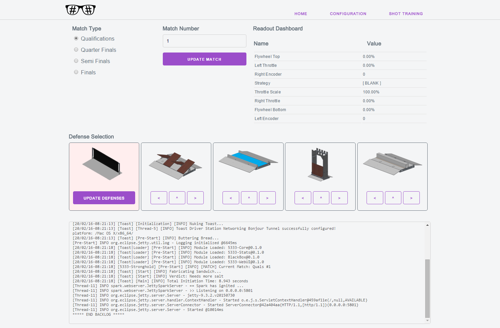
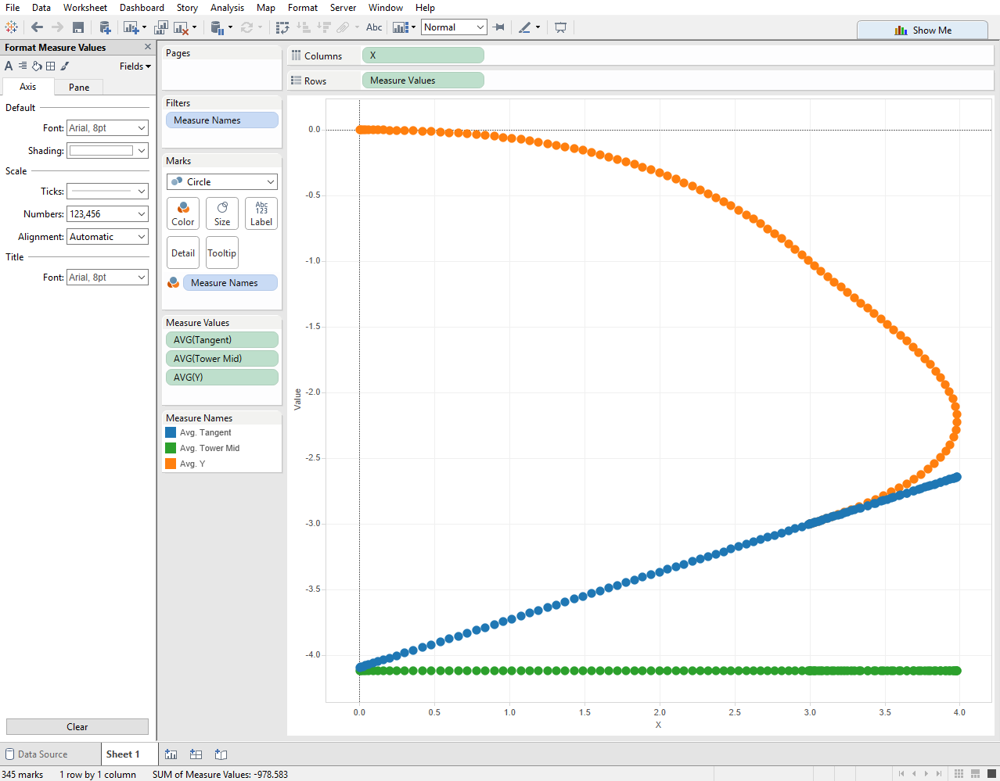
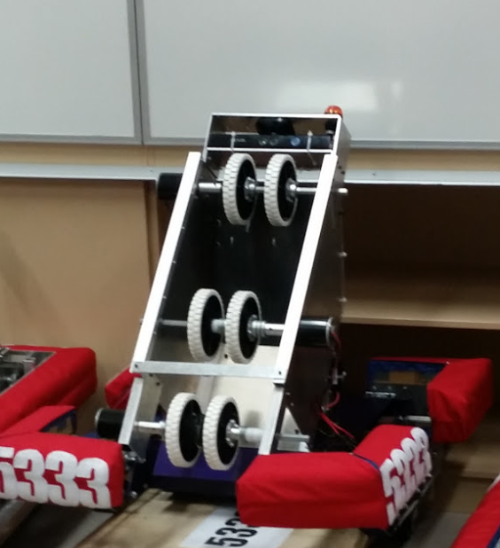

# 2016-Stronghold
Our code for the 2016 FIRST Robotics Competition Tournament - Stronghold!

This repository contains all the code we're using for the 2016 FRC Game. All the code in this repository is subject to change at any given time.

## What's this all about
For 2016, our robot's performance is very code-focused. We're using a Kinect Camera's Infrared and Depth Streams to attain the vision tracking targets on the high goals, motion profiling to move steadily (and accurately) around the field, and
the Raspberry Pi 2 board as a Coprocessor. Our default control system consists of a 2-Joystick Adaptive Drive. All RoboRIO code is built atop the
[Toast API](https://github.com/Open-RIO/ToastAPI)

Here's a breakdown of what's responsible for what:
- RoboRIO: Central commands
    - Project Root: Drive System, Core Libraries
    - 5333-Stats: Robot statistics recording via [BlackBox](https://github.com/Open-RIO/BlackBox)
    - 5333-WebUI: Custom Web Interface to configure the Robot prior to a match
    - 5333-Autonomous: Autonomous Module allowing us to load Autonomous Configurations from the Configuration File.
    
- Raspberry Pi 2 Coprocessor: Processing-Heavy code
    - [Motion Profiling](Coprocessor/Splines/) (spline and motion profiling)
    - [Visual Processing](Coprocessor/Kinect/) (kinect + opencv)

## Some Pictures and General Showing Off
### WebUI

### Autonomous Spybot Path
  
_orange_: Robot Path  
_blue_: Final Shot Path  
_green_: Field Bisector (in line with middle high goal)  

### Our Robot

## Why no Low Bar?
Instead of going for the same defense as _literally everybody else_, we decided it was more worth it to be able to shoot accurately, whether a defense bot was on our tail or not.
Our shooter is powered by 2 direct-drive MiniCIMs, with the shooter at a 45 degree angle to the horizontal, meaning we can shoot over a majority of robots. Because our camera is up high,
it means our vision tracking is, for the most part, unobstructed. If you have 2 other robots on the field that can do the lowbar, why would you bother?

## What is cool about your code
Well, it's split into modules, so that makes development pretty easy. 
We're using a new concept called Control Leases and Strategies this year. At any given time, only one strategy can be active. This is kind of like "only having one control method active at one" to avoid
having different parts of the code fight over who has control. Additionally, each subsystem has a Control Lease. A Control Leave can be acquired with a given priority. Within the `lease.use( () -> {  } )`
function, the subsystem can be used if it is the highest priority. Once a Control Lease is not required, `lease.release()` is called, leaving control to the next highest priority. This makes sure the subsystem
has one controller at a time.

Additionally, we're using Motion Profiling this year. As best demonstrated in [this video](https://www.youtube.com/watch?v=8319J1BEHwM) by the Cheesy Poofs (254), Motion Profiling is a way of generating
a nice, smooth path for your robot to follow based off of given waypoints. Unlike the poofs, we generate our profiles in relatime, offboard on our [Coprocessor](Coprocessor/Splines/). A fast control loop running
on the RoboRIO will then make sure that this path is followed accurately, through the use of Feedback/Feedforward loops fed by our encoders.

For shooting, we're using a lookup table based on our Vision System. This lookup table will interpolate values, and means that our shots are consistent and don't rely on error in calculating distances from the
goals. More of this is explained in the [Vision Coprocessor Readme](Coprocessor/Kinect/)

Our Autonomous Routines this year are loaded from the Configuration File. A demo of this can be seen under `Configs/`. Since this config file can be changed from the WebUI, we can manipulate our Autonomous Routines
on the fly, based on Motion Profiles and Vision. Not only is this versatile, but means that if we screw up on a waypoing or heading, we can quickly fix it in time for the next match.

## Autonomous?
Our autonomous so far relies on the Spy Bot area of the field. Because we don't have any defenses to test on, we have to wait until we get on an actual field to create an Autonomous Routine from the midfield. As explained
earlier however, this is very quick to do thanks to our Configuration Files.

## Control System?
Our control system this year is powered by a dual-joystick adaptive jaci-drive. If you want to see the specifics, you can do so [here](https://github.com/FRC5333/2016-Stronghold/blob/master/src/main/kotlin/frc/team5333/core/systems/DriveSystem.kt),
but here's a quick breakdown:

### Adaptive Drive
If only one joystick has the trigger held, that joystick is used to control the drive train, and the other one used to control the shooter/intake system. If both triggers are held down,
the Y axis on each joystick is used for that side of the drive train. For general driving, a single joystick is enough, but for fine-grained control, both joysticks can be used. 

### Jaci Drive
If using one joystick, we use a Jaci Drive configuration. Jaci Drive is very similar to a standard arcade drive, forward/back for throttle, side-to-side for ratio. However, if the X axis is on full-lock
(i.e. all the way to the right/left), the turning speed is only at 0.5. To reach a full 1.0 turning speed, the twist of the joystick is used. This means that for the most part, turning is kept slowly, as
to be accurate, but for situations where a faster, less accurate turn is required, the twist of the joystick can make that happen.

Also I named it Jaci Drive because my name is Jaci and I'm an egotistical prick apparently \*shrug*

## Language Choice?
Something that may strike you as odd is that we're using multiple languages in our repository, including Java, Kotlin, C and C++. Let me break it down:
- C / C++ is responsible for Coprocessor Code (motion profiling and vision processing). This is because, on the coprocessor, we need all the power we can get. Vision Processing and Motion Profiling are both very, very CPU intensive. For this 
reason, we decided to use C where possible, and C++ where it is required (e.g. for OpenCV)

- Java is used for our main robot code. This shouldn't come as a suprise considering we are using Toast.

- Kotlin is used in some places of our main code. You may not have heard of Kotlin before, but it's this really cool language that runs on the JVM, meaning it works seamlessly with Java. 
Kotlin has a nice syntax, with great support for manipulating data structures, which makes it functional in a way. Although Kotlin doesn't have statics, it's a language I've been meaning to try and so far
has not let me down. Kotlin is used where possible, and is used in most of our control code.